# C++ OOP Master Notes — Comprehensive Deep Dive

**I spent 8 days drowning in C++ OOP concepts, built a complete banking system, and emerged with insights that most tutorials never teach you.** This isn't another surface-level guide.

What you're about to read is the synthesis of a deep dive into Object-Oriented Programming with C++11, guided by Matt Weisfeld's *"The Object-Oriented Thought Process"* and a production-grade [Bank System Project](https://github.com/GziXnine/Bank_System).

---

## Resources

| Resource | Link |
|----------|------|
| **Bank System Project** | [GitHub Repository](https://github.com/GziXnine/Bank_System) |
| **Course Video Lectures** | [Google Drive](https://drive.google.com/drive/folders/1hOiaQjj_ErFMnAZ6f-9VekFmir0IeZZu) |
| **Book** | *The Object-Oriented Thought Process* — Matt Weisfeld |
| **C++ Reference** | [cppreference.com](https://en.cppreference.com/) |
| **ISO C++ Guidelines** | [C++ Core Guidelines](https://isocpp.github.io/CppCoreGuidelines/CppCoreGuidelines) |
| **Compiler Explorer** | [godbolt.org](https://godbolt.org/) — Inspect generated assembly |

---

## Table of Contents

1. [Foundations](#1-foundations)
2. [OOP Core Principles](#2-oop-core-principles)
3. [Access Modifiers Deep Understanding](#3-access-modifiers-deep-understanding)
4. [Constructors & Object Lifecycle](#4-constructors--object-lifecycle)
5. [Advanced OOP Topics](#5-advanced-oop-topics)
6. [OOP and Memory — Deep Integration](#6-oop-and-memory--deep-integration)
7. [Pointers vs References — A Structured Comparison](#7-pointers-vs-references--a-structured-comparison)
8. [How SOLID Principles Connect to Memory](#8-how-solid-principles-connect-to-memory)
9. [Book Deep Integration](#9-book-deep-integration)

---

## 1. Foundations

### 1.1 Core C++ Syntax Covered

Let's start with what was actually mastered during this intensive journey. Not the theory you'd find in any textbook, but the real features that made it from concept to working code:

| Feature | Mastery Level |
|---------|---------------|
| Function Overloading (`add(int,int)` vs `add(float,float)`) | Solid |
| Default Arguments (`CalcNetSalary` pattern) | Solid |
| References (`&`) — e.g., `swap` function | Solid |
| Pointers (`*`) — heap allocation | Solid |
| `new` / `delete` | Solid |
| `struct` vs `class` | Solid |
| Header Guards (`#ifndef`) | Solid |
| `const` correctness | Inconsistent |
| `static` members (`Math` class pattern) | Solid |
| Operator Overloading (`Complex` class) | Solid |
| Templates (`List<T>`) | Basic |
| `std::vector` | Solid |
| File I/O (`fstream`) | Solid |
| Exception Handling (`try/catch`) | Basic |

### 1.2 Memory Model — Stack vs Heap

**A key revelation about dynamic memory:**
> "الحاجات اللى فى الـ heap مش لازم يكون ليها اسم" — Things on the heap don't need a name.

**This simple observation unlocks everything about dynamic memory.** Here's why it matters:

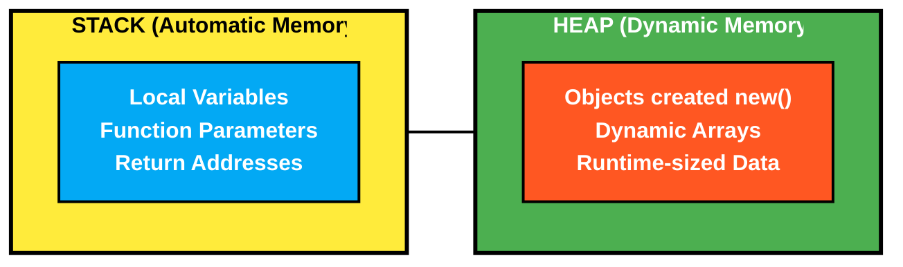

**Stack Memory:**

- Automatic lifetime — destroyed when scope ends
- Fast allocation — just moves the stack pointer
- Size must be known at compile time
- Variables have names
- LIFO order (Last In, First Out)

```cpp
int x = 5;          // x lives on the stack
Student s1;         // s1 lives on the stack
int arr[10];        // fixed-size array on stack
```

**Heap Memory:**

- Manual lifetime — you control it with `new` / `delete`
- Slower allocation — OS must find a free block
- Size can be determined at runtime
- Objects are accessed via pointers, not names
- No ordering guarantees

```cpp
int* p = new int(10);     // heap integer
int* arr = new int[n];    // dynamic array
Student* s = new Student; // heap object
```

> **Warning:** Every `new` MUST have a matching `delete`. Every `new[]` MUST have a matching `delete[]`.

**Here's how this works in practice:**

```cpp
int* p = new int[10];    // Array of 10 ints on heap
int* ptr = new int(10);  // Single int initialized to 10 on heap

delete[] p;   // Correct: array delete for array allocation
delete ptr;   // Correct: scalar delete for scalar allocation
```

**The Golden Rule (Break it at your peril):**
- `new` → `delete`
- `new[]` → `delete[]`

Mix these up? Welcome to the realm of undefined behavior—where your program crashes on Fridays but works fine on Mondays, and debugging becomes an exercise in existential despair.

### 1.3 Compilation Process

Every time you run a build command like `g++ -std=c++11 -Wall -Wextra`—a fascinating multi-stage transformation occurs behind the scenes.

The C++ compilation process has 4 distinct stages:

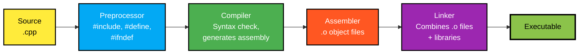

**Why this matters in practice:**

Each `.cpp` file compiles independently into an `.o` (object) file. Headers get **literally copy-pasted** by the preprocessor into every file that includes them. And the linker? It's the conductor bringing this orchestra together—for example, when `Client.cpp` calls `Validation::isValidName()`, the linker finds it in `Validation.o`.

**Why header guards (`#ifndef`) are critical:**
```cpp
#ifndef PERSON_H      // If PERSON_H is NOT defined...
#define PERSON_H      // ...define it and include the content

class Person { ... };

#endif                // End of the guard
```

Without guards, if two files both `#include "Person.h"`, the compiler would see `class Person` defined twice → **compilation error**.

### 1.4 Header vs Source Separation

**A production-grade [Bank System](https://github.com/GziXnine/Bank_System) crystallizes this perfectly:**
> `.h` = WHAT the class can do (interface / contract)  
> `.cpp` = HOW it does it (implementation / logic)

This separation isn't just convention—it's the foundation of maintainable C++ architecture. Here are the formal rules:

| Put in `.h` (Header) | Put in `.cpp` (Source) |
|---|---|
| Class declaration | Method bodies (implementations) |
| Member variable declarations | Static member initialization |
| Method *signatures* (prototypes) | Complex logic |
| `#include` for types used in the declaration | `#include` for types used only in implementation |
| Template definitions (MUST be in header) | `using namespace std;` (never in headers!) |
| Inline/short functions (optionally) | Private helper function bodies |

**The namespace paradox explained:**

Why is `using namespace std;` acceptable in `.cpp` files but forbidden in headers? Consider this example from a Bank System:
```cpp
// Person.h — CORRECT
class Person {
protected:
    std::string name;     // Explicit std:: prefix
    std::string password;
};
```

In `.cpp` files, `using namespace std;` is acceptable because it only affects that one file:
```cpp
// Person.cpp — Acceptable
using namespace std;
```

**Why this matters:** 

Put `using namespace std;` in a header, and suddenly every file that includes it inherits your namespace decision. In a small project? Annoying. In a codebase with 50+ contributors? Catastrophic naming collisions.

> **Reality check:** Early OOP exercises often use `using namespace std;` in headers—acceptable for learning, toxic for production. A well-architected project avoids this.

### 1.5 The `this` Pointer

**The common initial understanding:**
> "I Will Use `this->` In Two Cases:  
> 1. When The Parameter Name Is The Same As The Member Variable Name.  
> 2. When I Want To Return The Current Object From A Function (Fluent Interface)."

**True, but there's more to the story.** The `this` pointer reveals itself in four distinct scenarios:

```cpp
class Employee {
    int salary;
public:
    // Case 1: Disambiguation — parameter shadows member
    void setSalary(int salary) {
        this->salary = salary;  // this->salary = member, salary = parameter
    }

    // Case 2: Return *this for method chaining (Fluent Interface)
    Employee& raiseSalary(int amount) {
        salary += amount;
        return *this;  // Returns reference to current object
    }

    // Case 3: Pass current object to another function
    void registerWith(Registry& reg) {
        reg.add(this);  // Pass pointer to current object
    }

    // Case 4: Compare with another object
    bool operator==(const Employee& other) const {
        return this->salary == other.salary;
        // Here this-> is optional but adds clarity
    }
};
```

**Behind the scenes (what the compiler does):**

Here's the key insight:
```cpp
void moveForward()  // Actually: void moveForward(Car* this)
```

Every non-static member function secretly receives a `this` pointer as its first parameter. The compiler transforms:
```cpp
c1.moveForward();     →     moveForward(&c1);
c1.speed;             →     (&c1)->speed;
```

---

## 2. OOP Core Principles

### 2.1 The Four Pillars

Understanding all four pillars intellectually is one thing. Wielding them in production code? That's where the real education begins.

### 2.2 Abstraction

**The fundamental insight about abstraction:**
> "بحط وصف لطرف من اطراف المشكلة بيتضمن حاجتين على العموم بس بيكون متركز على السياق" — I describe an aspect of the problem that contains attributes and behaviors, focused on the context.

**Here's what abstraction really means:**

Model only what matters for your specific problem domain. A `Person` in a bank system needs `id`, `name`, and `password`. But `height`? `shoe_size`? `blood_type`? 

These exist in reality but are noise in the banking context. Abstraction is the art of strategic omission.

| Real Person Attributes | Bank System's `Person` | Included? |
|------------------------|------------------------|-----------|
| name | `name` | Yes — needed for identification |
| age | — | No — irrelevant to banking |
| height | — | No — irrelevant to banking |
| blood type | — | No — irrelevant to banking |
| shoe size | — | No — irrelevant to banking |
| — | `password` | Yes — needed for authentication |
| — | `id` | Yes — needed for lookup |

**From the book (Weisfeld):**
> "The interface should be kept to a minimum. Only essential services should be exposed."

**The [Bank System](https://github.com/GziXnine/Bank_System) demonstrates this well:** `Person` only has `id`, `name`, `password` — exactly what every user in the bank system needs. No more, no less.

### 2.3 Encapsulation

**A crucial breakthrough in understanding encapsulation:**
> "Encapsulation is hiding internal details... بيخبى الداتا علشان معلومات متهمكش وعلشان سيكيورتى ريزونز"  
> "Control Visibility of Data and Functions."

**Correct—but there's a subtle distinction that changes everything.** Two concepts are often conflated:

| Concept | What It Means | Example |
|---------|---------------|----------------------|
| **Encapsulation** | Bundling data + methods into a single unit (class) | `Employee` bundles `salary` with `setSalary()`, `getSalary()` |
| **Data Hiding** | Making internal data private and controlling access | `salary` is `private`, only accessible through getters/setters |

**Encapsulation ≠ Data Hiding.** Encapsulation is the bundling. Data hiding is the access control. You can have encapsulation without data hiding (all public), but you should almost never do that.

**This Employee class demonstrates the concept perfectly:**

```cpp
class Employee {
private:
    int salary = 5001;  // Hidden: nobody can set to invalid value

public:
    void setSalary(int salary) {
        if (salary > 5000)
            this->salary = salary;
        else
            this->salary = 5000;  // Business rule enforced!
    }

    int getSalary() {
        return salary;
    }
};
```

**The ATM analogy that makes it click:**

Think of a bank ATM. You can deposit and withdraw (public interface). You cannot directly edit the database (private implementation). The ATM enforces business rules—you can't withdraw more than your balance.

**Without encapsulation:**
```cpp
client.balance = -999999;  // Chaos. No validation. No rules.
```

**With encapsulation:**
```cpp
client.setBalance(-999999);  // Setter validates, rejects, protects.
```

One line. Completely different universes of safety.

### 2.4 Inheritance

**A philosophical observation about inheritance:**
> "اكتشفنا فى حياتنا ان اى حاجة بتورث صفاتها من حاجات تانية بس بطرق مختلفة او عن طريق انها تزود عليها بعض الصفات"  
> — We discovered that things inherit traits from other things, either differently or by adding new traits.

**This mirrors nature itself. In code, we call it the IS-A relationship:**

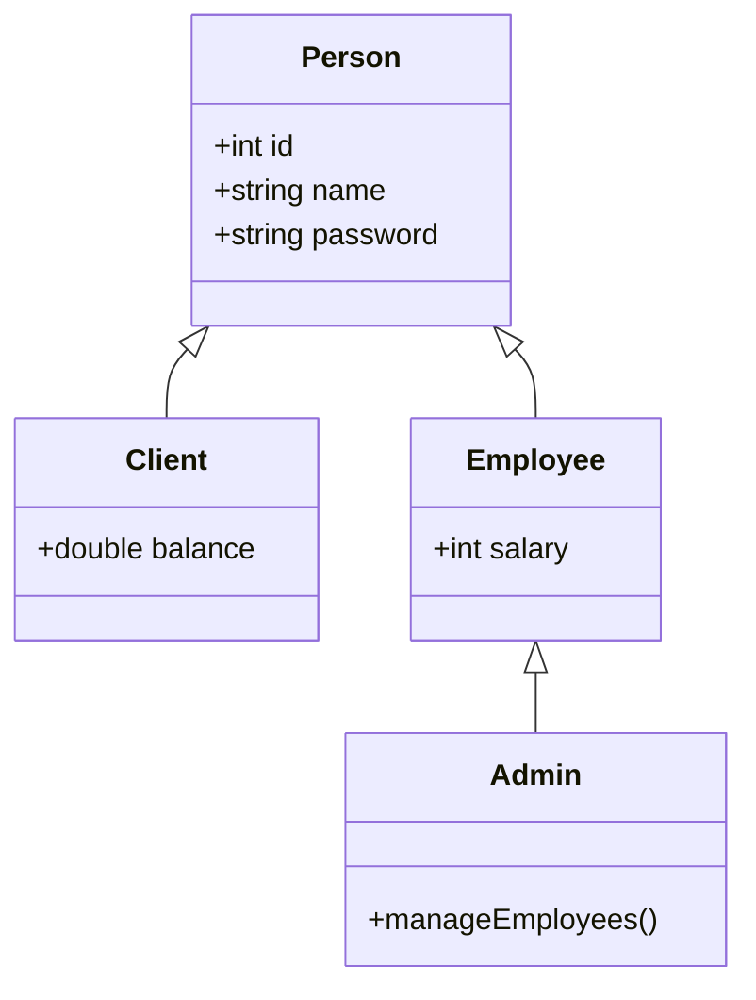

In the [Bank System](https://github.com/GziXnine/Bank_System):
- `Client` IS-A `Person` (has id, name, password + balance)
- `Employee` IS-A `Person` (has id, name, password + salary)
- `Admin` IS-A `Employee` (has everything Employee has + employee management)

**What inheritance gives you:**
1. **Code reuse** — `id`, `name`, `password` are defined ONCE in `Person`
2. **Polymorphism** — A `Person*` can point to any derived type
3. **Hierarchical organization** — Reflects real-world relationships

**Constructor Chaining — a critical inheritance concept:**

When a derived class is constructed, the base class constructor always runs first. You can explicitly call the parent constructor using the initializer list:

```cpp
// When you create a Human, the Creature constructor runs FIRST
Human() : Creature(50)   // ← Calls parent constructor explicitly
{
    height = 180;         // Then child constructor body runs
    age = 5;
}
```

**The order is always:** Parent constructor --> Child constructor  
**Destructor order is reversed:** Child destructor --> Parent destructor

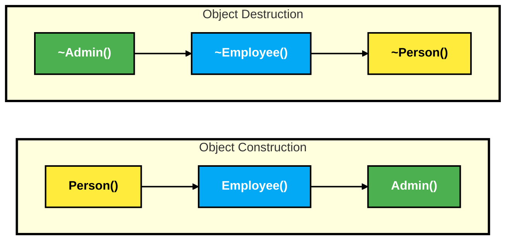

### 2.5 Polymorphism

**The moment polymorphism clicks:**
> "Polymorphism → The ability of an object to take on many forms"

Simple definition. Profound implications. Here are the two types that emerged:

| Type | When Resolved | Mechanism | Example |
|------|--------------|-----------|-------------|
| **Compile-time** (Static Binding) | At compilation | Function overloading, operator overloading | `add(int,int)` vs `add(float,float)` |
| **Runtime** (Dynamic Binding) | At execution | Virtual functions, base pointers | `Creature* c = new Human(); c->move();` |

**The epiphany — one keyword changes everything:**

The difference between `virtual` and non-virtual isn't academic. It's the difference between code that works and code that lies to you.

```cpp
// WITHOUT virtual (HIDING, not overriding)
class Creature {
public:
    void move() { cout << "Creature moving"; }  // Non-virtual
};

class Human : public Creature {
public:
    void move() { cout << "Human moving"; }     // HIDES parent's move()
};

Creature* c = new Human();
c->move();  // OUTPUT: "Creature moving" ← WRONG! We wanted Human's behavior
```

```cpp
// WITH virtual (TRUE overriding)
class Creature {
public:
    virtual void move() { cout << "Creature moving"; }  // Virtual!
};

class Human : public Creature {
public:
    void move() override { cout << "Human moving"; }    // Overrides
};

Creature* c = new Human();
c->move();  // OUTPUT: "Human moving" ← CORRECT! Dynamic dispatch works
```

**Behind the magic — vtables revealed:**

When you declare a `virtual` function, the compiler performs secret alchemy. It creates a hidden lookup table called a **vtable** (virtual function table):

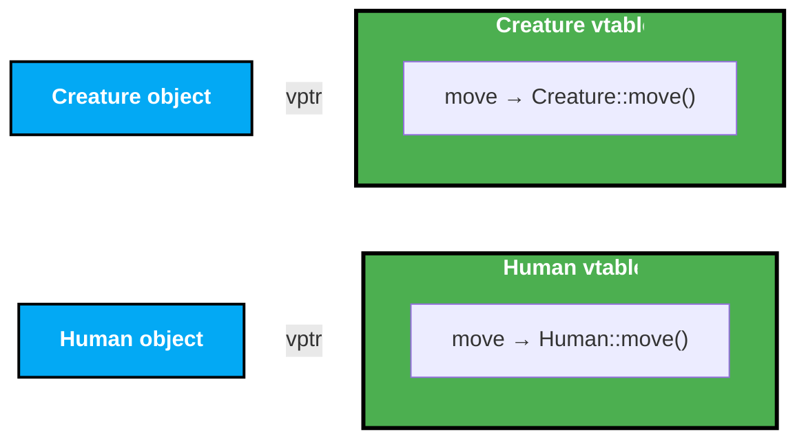

Every object with virtual functions has a hidden pointer (`vptr`) to its class's vtable. When you call `c->move()`, the runtime:
1. Follows `c->vptr` to find the vtable
2. Looks up `move` in the vtable
3. Calls the function the vtable points to

This extra indirection is why polymorphism has a small runtime cost. One pointer dereference. Negligible performance hit. Massive architectural flexibility.

**The Game class—where theory becomes practice:**

```cpp
class Game {
    Creature* creatures[10];  // Array of BASE pointers

public:
    void addCreature(Creature* c) {
        // Can accept Human*, Animal*, or any future Creature subclass
    }

    void run() {
        for (int i = 0; i < 10; i++) {
            if (creatures[i] != nullptr)
                creatures[i]->move();  // Calls the RIGHT move() for each type
        }
    }
};

// Usage:
game.addCreature(new Human());   // Human::move() will be called
game.addCreature(new Animal());  // Animal::move() will be called
```

This is **the Open/Closed Principle** in its purest form: open for extension (add new creature types), closed for modification (never touch `Game` again).

### 2.6 Hiding vs Overriding — A Critical Distinction

**A crucial distinction many miss:**
> `move()` "This isn't Overriding, It's Hiding"

**The completion of the thought:**
> "But if I Put a 'Virtual' Keyword in the Move Function in the Creature Class, It will be Overriding not Hiding"

Two different mechanisms. Easily confused. Dramatically different behavior:

| Scenario | Base has `virtual`? | Derived redefines? | What happens through base pointer? |
|----------|-------|--------|------|
| **Hiding** | No | Yes | Base version is called (static dispatch) |
| **Overriding** | Yes | Yes | Derived version is called (dynamic dispatch) |

**An important note about virtual propagation:**
> "لو الاب كتب virtual ف كل الاطفال بتبقى virtual ديفولت"  
> If the parent writes `virtual`, all children's versions are implicitly `virtual`.

```cpp
class Creature {
    virtual void move();     // Explicitly virtual
};

class Human : public Creature {
    void move();             // IMPLICITLY virtual (inherited from Creature)
};

class Employee : public Human {
    void move();             // IMPLICITLY virtual (inherited from Human)
};
```

The `override` keyword (C++11) makes this explicit and catches errors:
```cpp
class Human : public Creature {
    void move() override;     // OK — Compiler verifies Creature has virtual move()
    void moove() override;    // ERROR — no function to override (typo caught!)
};
```

---

## 3. Access Modifiers Deep Understanding

### 3.1 The Three Access Levels

**The foundation of access control:**
> - Private → Only Accessible Within The Class.
> - Public → Accessible From Anywhere.
> - Protected → Accessible Within The Class And Its Derived Classes.

The basics are simple. The nuances? That's where beginners stumble. Here's the precision version:

```cpp
class Parent {
private:
    int x;        // Only Parent's own methods can access x

protected:
    int y;        // Parent's methods + any derived class's methods

public:
    int z;        // Anyone can access z
};

class Child : public Parent {
    void foo() {
        // x = 10;  BLOCKED — Private: NOT accessible in Child
        y = 20;     // Protected: accessible in Child
        z = 30;     // Public: accessible anywhere
    }
};

class Grandchild : public Child {
    void bar() {
        // x = 10;  BLOCKED — Still not accessible (private to Parent forever)
        y = 20;     // Still protected: accessible in descendants
        z = 30;     // Still public
    }
};

int main() {
    Parent p;
    // p.x = 10;  BLOCKED — Private
    // p.y = 20;  BLOCKED — Protected (main is not a derived class)
    p.z = 30;     // Public
}
```

### 3.2 Inheritance Access Types

**The inheritance access matrix (that finally makes sense):**

| Parent Member | `public` Inheritance | `protected` Inheritance | `private` Inheritance |
|---------------|----------------------|-------------------------|-----------------------|
| `private` | Not accessible | Not accessible | Not accessible |
| `protected` | `protected` | `protected` | `private` |
| `public` | `public` | `protected` | `private` |

**What this means in practice:**

```cpp
class Base {
public:    int a;
protected: int b;
private:   int c;
};

// PUBLIC inheritance: "Child IS-A Base" — most common, preserves interface
class Child1 : public Base {
    // a is public, b is protected, c is not accessible
};

// PROTECTED inheritance: Rarely used — hides base interface from outsiders
class Child2 : protected Base {
    // a is protected, b is protected, c is not accessible
};

// PRIVATE inheritance: "Child IS-IMPLEMENTED-IN-TERMS-OF Base" — composition alternative
class Child3 : private Base {
    // a is private, b is private, c is not accessible
};
```

**The pragmatic rule:**

Use `public` inheritance 99% of the time—it models true IS-A relationships. The other two? Advanced techniques for specialized scenarios. 

The [Bank System](https://github.com/GziXnine/Bank_System) exclusively uses `public` inheritance. That's not a limitation—it's wisdom.

### 3.3 struct vs class — The Only Difference

**The key distinction:**
> Struct → Access Modifiers Are Public By Default.  
> Class → Access Modifiers Are Private By Default.

**This is the ONLY difference in C++.** Everything else is identical:

```cpp
struct Foo {
    int x;      // public by default
    void bar(); // public by default
};

class Bar {
    int x;      // private by default
    void baz(); // private by default
};
```

**Convention:** Use `struct` for plain data containers (no complex logic). Use `class` for objects with behavior and encapsulation. A natural progression in learning is to start with `struct` for simple data (like a `Car`) and graduate to `class` when encapsulation matters (like `Employee`).

### 3.4 What Happens in Memory

When you create an object, its members are laid out sequentially in memory:

```cpp
class Employee {
private:   int salary;    // 4 bytes
public:    int id;         // 4 bytes
};
```

In memory (simplified), both members occupy contiguous bytes regardless of access level:

| Offset | Member | Size |
|--------|--------|------|
| 0x00 | `salary` | 4 bytes |
| 0x04 | `id` | 4 bytes |
| | **Total** | **8 bytes** |

**Access modifiers do NOT affect memory layout.** They are purely a compile-time concept. `private` doesn't encrypt or hide the data in memory — it just makes the compiler refuse to compile code that accesses it directly.

If you have a pointer to the raw memory, you can technically read private data (but you should NEVER do this):
```cpp
Employee e(5000);
int* hack = reinterpret_cast<int*>(&e);
cout << *hack;  // Could print salary — undefined behavior, never do this!
```

### 3.5 Private Access in Practice — Beyond the Basics

The `reinterpret_cast` example above is a cautionary tale, but there are legitimate reasons to understand how private members behave in memory. Here are three practical scenarios that deepen your understanding.

**3.5.1 Manual Array Resizing — Why Private State Matters**

When a class manages a dynamic array internally, resizing must happen through controlled methods. Exposing the raw pointer would let users corrupt the array's size tracking:

```cpp
class IntArray {
private:
    int* data;
    int size;
    int capacity;

    void resize(int newCapacity) {
        int* newData = new int[newCapacity];
        for (int i = 0; i < size; i++)
            newData[i] = data[i];
        delete[] data;
        data = newData;
        capacity = newCapacity;
    }

public:
    IntArray(int initialCapacity = 4) 
        : size(0), capacity(initialCapacity) {
        data = new int[capacity];
    }

    ~IntArray() { delete[] data; }

    void add(int value) {
        if (size >= capacity)
            resize(capacity * 2);  // Private resize — user never sees this
        data[size++] = value;
    }

    int get(int index) const {
        if (index < 0 || index >= size)
            throw out_of_range("Index out of bounds");
        return data[index];
    }

    int getSize() const { return size; }
};
```

If `data`, `size`, and `capacity` were public, any caller could write `arr.size = 999;` while the actual array holds 4 elements. The next `add()` call would write past the allocated block — corrupting heap memory silently. The private access ensures that `size`, `capacity`, and `data` always stay in sync.

**3.5.2 Static Counter — Memory Location and Object Tracking**

Static members live in a different memory region than instance members. Understanding where they reside clarifies why they persist across objects:

```cpp
class Sensor {
private:
    int id;
    static int totalSensors;  // Lives in .data/.bss segment, NOT on the stack/heap

public:
    Sensor() : id(++totalSensors) {}

    int getId() const { return id; }
    static int getTotal() { return totalSensors; }
    
    static void resetCounter() { 
        totalSensors = 0;  // Useful in testing or system reinitialization
    }
};

int Sensor::totalSensors = 0;  // Initialized in .data segment (global storage)

// Usage:
Sensor s1;  // id=1, totalSensors=1 (static memory: unchanged location)
Sensor s2;  // id=2, totalSensors=2 (same static address, new value)
Sensor s3;  // id=3, totalSensors=3

// Each object has its own 'id' on stack/heap, but all share ONE 'totalSensors'
// Stack:  s1{id=1}  s2{id=2}  s3{id=3}   (3 copies of id)
// Static: totalSensors=3                    (1 copy, shared)
```

The `resetCounter()` method is useful in long-running applications where you may need to reinitialize subsystems without restarting the entire program.

---

## 4. Constructors & Object Lifecycle

### 4.1 Constructor Fundamentals

**A mind-bending paradox:**
> "هل الكونيستركتول مسؤول عن الكيريشن بتاع الاوبجيكت؟؟ لاء"  
> "هل اقدر اعمل اوبجيكت من غير م اعمل انيستركتور؟؟ لاء"  
> — Is the constructor responsible for CREATING the object? No.  
> — Can I create an object without a constructor? No.

**Mind-bending but crucial:** The constructor **initializes**, it doesn't **create**. Memory allocation happens first. Then the constructor breathes life into that memory:

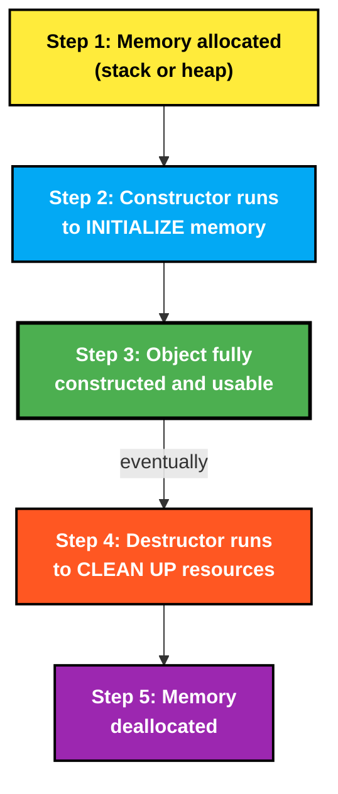

### 4.2 Types of Constructors

| Constructor Type | Syntax | Example Use Case |
|---|---|---|
| Default (no params) | `Employee() {}` | Creating objects with default state |
| Parameterized | `Employee(int salary)` | Initializing with specific values |
| Copy Constructor | `List(const List& old)` | Deep copying dynamic resources |
| Compiler-generated default | (you don't write it) | Simple `struct`s with no special needs |

### 4.3 Member Initializer Lists

**Here's a common example using them:**
```cpp
Employee(int id, const string& firstName, const string& lastName, int salary)
    : id(id), firstName(firstName), lastName(lastName), salary(salary)
{ }
```

**Why initializer lists are important:**

```cpp
// METHOD 1: Assignment in body (works but suboptimal)
Person(const string& name) {
    this->name = name;  // name is DEFAULT-constructed first, then ASSIGNED
}
// Result: default constructor + assignment operator = 2 operations

// METHOD 2: Initializer list (preferred)
Person(const string& name) : name(name) {
    // name is DIRECTLY constructed with the value = 1 operation
}
```

**When initializer lists are REQUIRED (not just preferred):**
1. `const` members — can't be assigned after construction
2. Reference members — must be bound at construction
3. Members without default constructors
4. Base class constructors

```cpp
class Config {
    const int MAX_SIZE;     // const: MUST use initializer list
    int& ref;               // reference: MUST use initializer list
    Database db;            // no default constructor: MUST use initializer list

public:
    Config(int size, int& r, string connStr)
        : MAX_SIZE(size), ref(r), db(connStr)  // All three MUST be here
    { }
};
```

### 4.4 Copy Constructor Deep Dive

**When everything goes wrong—then right:**

Writing a `List` class with dynamic memory teaches the lesson that textbooks try to explain but only crashes truly teach.

**The Problem — Shallow Copy (or: why your program crashes on Fridays):**

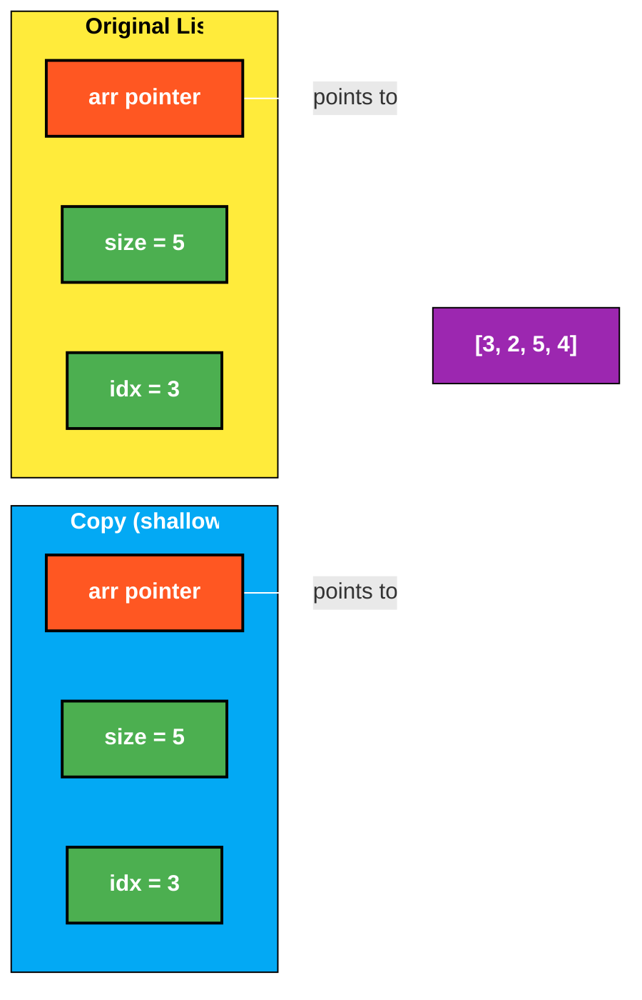

Both objects point to the **same** underlying array. When the copy is destroyed, it `delete[]`s the shared array. The original's `arr` pointer now points to freed memory — a dangling pointer. 

Crash? Maybe. Corrupted data? Probably. Debuggable? Good luck.

**The Solution — Deep Copy (salvation in code form):**

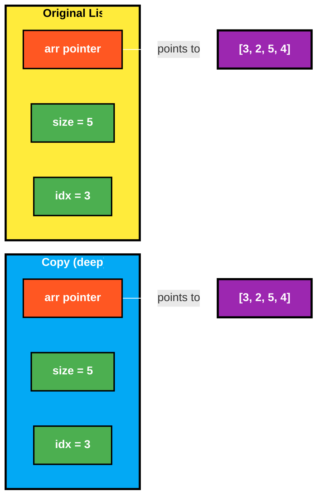

Each object has its **own** memory. Safe.

**A common initial implementation:**
```cpp
List(const List& oldList) {
    *this = oldList;              // Copy size, currentIndex (shallow)
    arr = new int[size];          // Allocate NEW memory

    for (int i = 0; i <= oldList.currentIndex; i++)
        this->arr[i] = oldList.arr[i];  // Copy each element
}
```

> **Mentor Note:** Line `*this = oldList;` calls the copy assignment operator before the object is fully constructed. This is risky because the default assignment copies the `arr` pointer (shallow), then you immediately overwrite it with `new int[size]`. The old shallow-copied pointer is leaked. A safer approach:

```cpp
List(const List& oldList) 
    : size(oldList.size), currentIndex(oldList.currentIndex) {
    arr = new int[size];
    for (int i = 0; i <= currentIndex; i++)
        arr[i] = oldList.arr[i];
}
```

### 4.5 Copy Assignment Operator

**Consider this custom assignment operator for a `Complex` class:**

```cpp
Complex operator=(const Complex& other) {
    this->real = other.real;
    this->imag = other.imag;
    for (int i = 0; i < 3; i++)
        this->values[i] = other.values[i];  // Deep copy
    return *this;
}
```

> **Mentor Corrections:**
> 1. Should return `Complex&` (reference), not `Complex` (value). Returning by value creates an unnecessary copy.
> 2. Should check for self-assignment (`if (this == &other) return *this;`)
> 3. For classes with dynamic memory, should handle the old memory before allocating new.

**Corrected version:**
```cpp
Complex& operator=(const Complex& other) {
    if (this == &other) return *this;  // Self-assignment check

    this->real = other.real;
    this->imag = other.imag;

    // Deep copy (assuming same size; otherwise delete[] old and new[])
    for (int i = 0; i < 3; i++)
        this->values[i] = other.values[i];

    return *this;  // Return reference, not copy
}
```

### 4.6 The Rule of Three

**The sacred trinity of resource management:**

If a class manages a resource (dynamic memory, file handles, network connections), you must implement THREE things:

1. **Destructor** — to release the resource
2. **Copy Constructor** — to deep-copy the resource
3. **Copy Assignment Operator** — to deep-copy on assignment

Implement two out of three? Your code is a ticking time bomb.

**A `List` class with dynamic memory implements all three:**
- Destructor: `~List() { delete[] arr; }`
- Copy Constructor: `List(const List& oldList) { ... deep copy ... }`
- Copy Assignment: Often missing! (implicitly used but not explicitly defined)

**The Rule of Five (C++11):**

C++11 adds move semantics, extending the Rule of Three to Five:

4. **Move Constructor** — transfer ownership instead of copying
5. **Move Assignment Operator** — transfer ownership on assignment

```cpp
// Move constructor — "steal" the resources from a temporary
List(List&& other) noexcept 
    : arr(other.arr), size(other.size), currentIndex(other.currentIndex) {
    other.arr = nullptr;       // Leave the source in a valid state
    other.size = 0;
    other.currentIndex = -1;
}

// Move assignment
List& operator=(List&& other) noexcept {
    if (this != &other) {
        delete[] arr;          // Free our current resource
        arr = other.arr;       // Steal theirs
        size = other.size;
        currentIndex = other.currentIndex;
        other.arr = nullptr;   // Leave source valid
    }
    return *this;
}
```

### 4.7 Destructor Deep Dive

**An immutable law of destructors:**
> "Can't Overload the destructor" — Correct. One class, one destructor. No exceptions.

**Destruction order in inheritance (ignore this at your peril):**
```cpp
class A {
public:
    ~A() { cout << "~A" << endl; }
};

class B : public A {
public:
    ~B() { cout << "~B" << endl; }
};

class C : public B {
public:
    ~C() { cout << "~C" << endl; }
};

C obj;
// When obj is destroyed:
// Output: ~C  ~B  ~A   (child → parent, reverse of construction)
```

**Virtual Destructors—a critical safeguard in any inheritance hierarchy:**

In a Bank System, the `Person` base class declares a virtual destructor:
```cpp
virtual ~Person();  // ← VIRTUAL destructor
```

**Why this one keyword prevents resource leaks:**

```cpp
Person* p = new Client(1, "Ahmed", "pass1234", 5000);

delete p;  // Which destructor is called?
```

- WITHOUT virtual: Only `~Person()` runs → `Client`'s resources leak into the void
- WITH virtual: `~Client()` runs first, then `~Person()` → proper cleanup

**The iron law: If a class has ANY virtual function, its destructor MUST be virtual.** 

Forget this rule, and you'll be hunting phantom memory leaks for days.

### 4.8 Constructor Order in Inheritance

**A fundamental rule:**
> "الكونستراكتور بتاع الاب هو اللى بيتعمل الاول قبل ما الكونستركتور بتاع الابن يتعمل"  
> — The parent's constructor runs first, before the child's constructor.

**Full order for a Bank System's `Admin` class (which inherits from `Employee`, which inherits from `Person`):**

```
Creating: Admin admin(1, "Boss", "admin123", 10000);

1. Person::Person(1, "Boss", "admin123")     ← Base class first
2. Employee::Employee(... , 10000)            ← Middle class second  
3. Admin::Admin()                             ← Derived class last

Destroying: admin goes out of scope

1. Admin::~Admin()       ← Derived first
2. Employee::~Employee() ← Middle second
3. Person::~Person()     ← Base class last
```

---

## 5. Advanced OOP Topics

### 5.1 Virtual Functions & Pure Virtual Functions

**The textbook-perfect definitions:**
> "Virtual Function → A function that can be overridden in a derived class and allows for dynamic dispatch"  
> "Pure Virtual Function → A virtual function that is declared by assigning '0' to it"  
> "Abstract Class → A class that cannot be instantiated"

Correct. Now let's see what they look like in the wild:

```cpp
// Regular virtual (CAN be overridden, HAS a default implementation)
virtual void move() {
    cout << "Default movement" << endl;
}

// Pure virtual (MUST be overridden, no default implementation)
virtual void move() = 0;
```

**Abstract vs Concrete classes:**

| Property | Abstract Class | Concrete Class |
|----------|----------------|----------------|
| Pure virtual functions | Has at least one | All implemented |
| Instantiation | Cannot be instantiated | Can be instantiated |
| Constructors | Can have | Can have |
| Implemented methods | Can have | Required |
| Role | Base class / interface | Leaf / usable class |

**Examples:**

| Abstract | Concrete |
|----------|----------|
| `Creature` | `Human` |
| `Shape` | `Circle`, `Rectangle` |
| `Person` (Bank System) | `Client`, `Employee` |
| `Payment_Method` | `Credit_Card`, `Debit_Card` |
| `DataSourceInterface` | `FileManager` |

### 5.2 Upcasting and Downcasting

**The casting revelation:**
> "Upcasting → تحويل الابن الى الاب" — Converting child to parent

One is safe. One is dangerous. Learn the difference or pay the price:

```cpp
// UPCASTING (safe, implicit, always valid)
Human h;
Creature* c = &h;          // Upcast: Human* → Creature*
Creature* c2 = new Human();  // Upcast on heap

// DOWNCASTING (dangerous, explicit, may fail)
Creature* c = new Human();
Human* h = dynamic_cast<Human*>(c);  // Downcast: Creature* → Human*
if (h != nullptr) {
    h->speak();  // Safe: we verified the cast succeeded
}
```

**Why upcasting is safe:** A `Human` IS-A `Creature`. Every `Human` has all `Creature` features.

**Why downcasting is dangerous:** A `Creature*` might point to an `Animal`, not a `Human`. Calling `speak()` on an `Animal` would be invalid.

**The Bank System uses upcasting for `updatePassword`:**

For example, `ClientManager::updatePassword` accepts a `Person*` base pointer, allowing it to work with any derived type:
```cpp
// ClientManager::updatePassword takes Person* (base pointer)
static void updatePassword(Person* person);

// Called with a Client (derived pointer → upcasted to Person*)
updatePassword(client);  // Client* → Person* (implicit upcast)
```

### 5.3 Abstract Classes as Interfaces

**The Bank System's `DataSourceInterface` is a pure interface:**

```cpp
class DataSourceInterface {
public:
    virtual ~DataSourceInterface() = default;

    virtual void addClient(const Client& client) = 0;
    virtual vector<Client> getAllClients() = 0;
    virtual void removeAllClients() = 0;
    // ... all pure virtual
};
```

This lets you swap implementations without changing business logic:

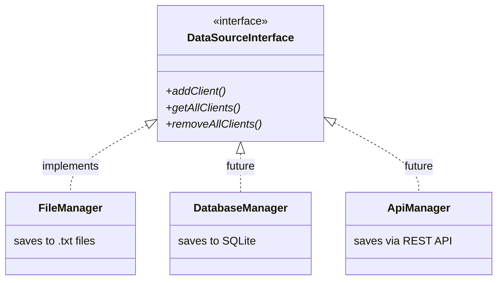

**This is the Dependency Inversion Principle (DIP):**
> Depend on abstractions, not on concrete classes.

### 5.4 The Diamond Problem

**C++'s most notorious edge case:**
> "Diamond Problem → Multiple Inheritance → Bad"  
> "Two Copies Of x In Derived Class → Ambiguity"  
> "I Can Use Virtual Inheritance To Solve This Problem"

The diamond problem is why many languages simply ban multiple inheritance. C++ gives you the rope. Here's how not to hang yourself:

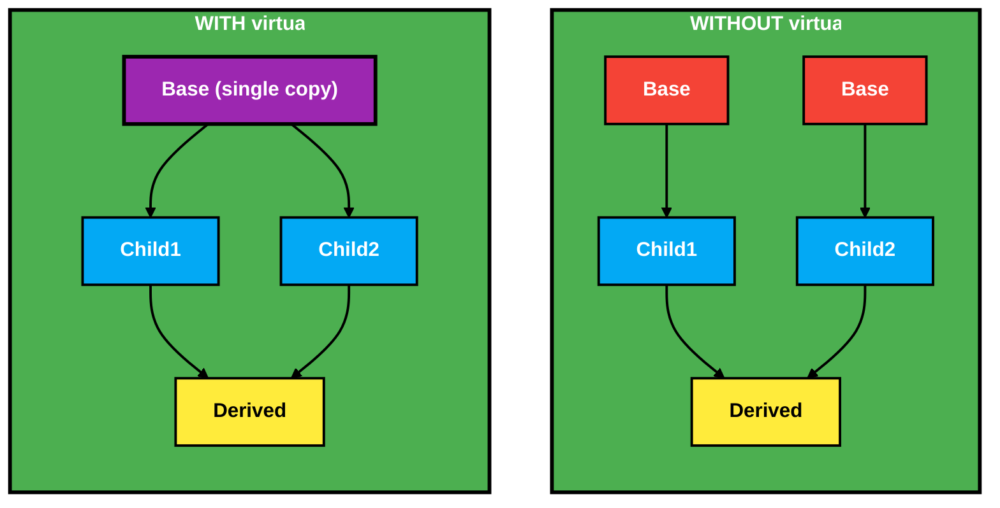

Without virtual inheritance, `Derived` gets **two copies** of `Base` — ambiguity. With virtual inheritance, only **one copy** exists.

**Here's how virtual inheritance solves it:**

```cpp
class Child1 : public virtual Base { ... };  // virtual!
class Child2 : public virtual Base { ... };  // virtual!

class Derived : public Child1, public Child2 {
    Derived() {
        x = 10;  // Now works — only ONE copy of Base::x
    }
};
```

**Constructor order with virtual inheritance:**

A common misconception: "Base class constructors execute in the order they are declared in the class inheritance list"

> **Mentor correction:** With virtual inheritance, the **most-derived class** (Derived) is responsible for calling the virtual base class constructor, and virtual bases are constructed BEFORE non-virtual bases.

```cpp
Derived() : Child2(), Child1() {  // You wrote this
    // But actual order is:
    // 1. Base()    ← Virtual base ALWAYS first
    // 2. Child1()  ← Order of inheritance declaration, NOT initializer list
    // 3. Child2()  
    // 4. Derived()
}
```

### 5.5 Multilevel Inheritance

Multilevel inheritance chains multiple levels of parent-child relationships:

```cpp
class Creature { void move(); };
class Human : public Creature { void move(); };
class Employee : public Human { void move(); };
```

**Here's an experiment that reveals static vs dynamic binding:**
```cpp
Employee* e = new Employee();
Human* e1 = new Employee();
Creature* e2 = new Employee();

e->move();   // Employee::move()
e1->move();  // Without virtual: Human::move()   (static binding)
e2->move();  // Without virtual: Creature::move() (static binding)
```

Since `Creature` doesn't have `virtual` in this case, all calls through base pointers use static binding (the pointer type determines which function is called, not the object type).

### 5.6 Overriding vs Overloading — A Key Clarification

**The distinction:**
> "Override → Same Name, Same Parameters, Different Implementation"  
> "Overload → Same Name, Different Parameters, Same Implementation"

> **Mentor correction on overloading:** Overloaded functions can have **different implementations too**. The key distinction is:

| | Override | Overload |
|---|---|---|
| Where | Different classes (parent-child) | Same class (or global scope) |
| Name | Same | Same |
| Parameters | Same | Different |
| Return type | Same (usually) | Can differ |
| `virtual` needed? | Yes (for polymorphism) | No |
| Resolution | Runtime (dynamic dispatch) | Compile-time (static dispatch) |

```cpp
// Overloading (same class, different parameters)
class Calculator {
    int add(int a, int b);           // Overload 1
    float add(float a, float b);     // Overload 2
    int add(int a, int b, int c);    // Overload 3
};

// Overriding (different classes, same signature)
class Shape {
    virtual double area() = 0;
};
class Circle : public Shape {
    double area() override { return 3.14 * r * r; }  // Override
};
class Rectangle : public Shape {
    double area() override { return w * h; }          // Override
};
```

### 5.7 Composition vs Inheritance

**The taxonomy of object relationships:**

| Relationship | Symbol | Meaning | Lifetime Coupling | Example |
|---|---|---|---|---|
| Association | Uses-A | Object uses another temporarily | Independent | `Instructor` uses `Marker*` |
| Aggregation | Has-A | Object contains another (weak) | Independent | `Room` has `Instructor*` |
| Composition | Part-Of | Object owns another (strong) | Dependent | `Invoice` has `Customer` |
| Inheritance | Is-A | Object is a specialized version | N/A | `Human` is-a `Creature` |

**An important heuristic for distinguishing composition and aggregation:**
> "لو الكيريشن حصل جوا الكلاس هنا يبقى علاقة كومبيزت لو الكيريشن حصل برا هيبقى علاقة اجريجيشن"  
> — If creation happens inside the class = composition; if outside = aggregation.

**This is a practical heuristic but let's refine it:**

- **Composition:** The contained object's lifetime is controlled by the container. When the container dies, the contained object dies too.
- **Aggregation:** The contained object can exist independently. The container holds a pointer/reference, doesn't own it.

```cpp
// Composition — Room OWNS its walls, walls die with the room
class Room {
    Wall walls[4];  // Walls are created WITH the room
    // When Room is destroyed, walls are automatically destroyed
};

// Aggregation — Room doesn't own the instructor
class Room {
    Instructor* ins;  // Instructor exists independently
    void instructorEnters(Instructor* i) { ins = i; }
    void instructorLeaves() { ins = nullptr; }
    // When Room is destroyed, instructor still exists
};
```

**From the book (Weisfeld):**
> "The question is: should we use inheritance or composition? Before you use inheritance, think about whether `Has-A` makes more sense than `Is-A`."

**The pragmatic approach:**

**Prefer composition over inheritance.** This isn't just advice—it's a battle-tested design principle. 

Use inheritance only when there's a genuine IS-A relationship. 

The [Bank System](https://github.com/GziXnine/Bank_System) demonstrates wisdom: `Client` IS-A `Person` (inheritance) + `Invoice` HAS-A `Customer` (composition). Both patterns, correctly applied.

### 5.8 Templates

**The final frontier of generic programming:**
> "امتى اقرر انى اعمل تيمبليت لما يبقى عندى اكتر من فانكشن ليها نفس الاسم بس بتاخد انواع مختلفة من البيانات"  
> — I decide to use a template when I have multiple functions with the same name taking different data types.

**Templates are C++'s superpower—write once, work for any type:**

```cpp
// Without templates — code duplication:
void swap(int& a, int& b)   { int temp = a; a = b; b = temp; }
void swap(float& a, float& b) { float temp = a; a = b; b = temp; }
void swap(string& a, string& b) { string temp = a; a = b; b = temp; }

// With templates — one definition handles ALL types:
template <typename T>
void swap(T& a, T& b) {
    T temp = a;
    a = b;
    b = temp;
}
```

**A `List` template class:**

```cpp
template <class T>
class List {
    T* items;
    int size, currentIndex;
public:
    List(int size) { items = new T[size]; ... }
    virtual void Add(T data) { ... }
    ~List() { delete[] items; }
};
```

**Using it:**
```cpp
List<int> intList(5);       // T = int → items = new int[5]
List<float> floatList(5);   // T = float → items = new float[5]
List<Employee> empList(10); // T = Employee → items = new Employee[10]
```

**An `EmployeeList` inheriting from `List<Employee>` is a great pattern:**

```cpp
class EmployeeList : public List<Employee> {
public:
    EmployeeList() : List(10) {}

    void Add(Employee emp) {
        if (emp.Salary < 5000)
            return;          // Business rule validation!
        List::Add(emp);      // Then delegate to parent
    }
};
```

This demonstrates **specialization through inheritance** — the generic `List<Employee>` handles storage mechanics, while `EmployeeList` adds domain-specific validation logic.

### 5.9 Friend Functions

**The controversial `friend` keyword:**

```cpp
// This allows: Complex c = 5 + someComplex;
friend Complex operator+(int num, const Complex& c) {
    Complex res;
    res.real = num + c.real;
    res.imag = c.imag;
    return res;
}
```

**Why is `friend` needed here?**

For `c1 + 5`, the compiler calls `c1.operator+(5)` — `c1` is the left operand, so it's a member function.

For `5 + c1`, the left operand is `int` — you can't add a member function to `int`! So you need a non-member function. But it needs access to `Complex`'s private members → `friend` grants that access.

**Friend breaks encapsulation—it's a calculated risk.** Use sparingly. In this case, it's the standard C++ idiom for symmetric operators. Sometimes you need to break the rules to write elegant code.

### 5.10 Common Pitfalls & Code Review

**Memory Leaks in Game-Style Classes**

A `Game` class that stores `Creature*` pointers from `new`, but whose destructor (implicitly generated) doesn't `delete` them, creates a memory leak:
```cpp
game.addCreature(new Human());   // Allocated with new
game.addCreature(new Animal());  // Allocated with new
// Game destructor doesn't delete these → MEMORY LEAK
```

**The fix:** Add a virtual destructor to `Game` that iterates through the array and calls `delete` on each non-null pointer. Better yet, use `std::unique_ptr<Creature>` to automate cleanup.

**Dead Code — Unused Members**

A common design smell: an `Employee` model might have `vector<Client> clients` as a member, but the actual system uses a centralized `ClientManager::clients` (a static shared cache) instead. The instance-level vector in `Employee` becomes dead code. Always audit your classes for unused members — they increase cognitive overhead and waste memory.

### 5.11 Practical Review Checklist

**What demonstrates strong OOP understanding:**

1. Identifying the need for a `Person` base class — not every developer sees this
2. Using the `override` keyword for virtual function overrides
3. Applying `const` to all getter methods
4. Creating a `DataSourceInterface` abstract class — shows architectural thinking
5. Separating presentation (Screens) from business logic (Managers) from data (Models)
6. Using `try/catch` for parsing file data — defensive programming
7. Build scripts including `-Wall -Wextra` for maximum compiler warnings
8. CSV format with auto-incrementing IDs — simple but effective persistence

**Areas to improve in any OOP project:**

1. Eliminate code duplication (DRY principle)
2. Remove unused fields and dead code
3. Add proper `const` across all read-only methods
4. Implement the Rule of Five for classes with dynamic memory
5. Consider using `std::unique_ptr` instead of raw pointers for owned resources
6. Add virtual destructors everywhere and handle cleanup of allocated resources

---

## 6. OOP and Memory — Deep Integration

Understanding how OOP constructs map to actual memory is the difference between writing code that compiles and writing code that performs. This section bridges the conceptual gap between object-oriented design and the machine's memory architecture.

### 6.1 Where Objects Live in Memory

Every object you create occupies real bytes in a specific memory region. The region depends on how you create it:

```cpp
void processEmployees() {
    Employee e1;                        // Stack: automatic, scoped
    Employee* e2 = new Employee();      // Heap: manual, persists until delete
    static Employee e3;                 // Static/Global: lives for entire program
}
```

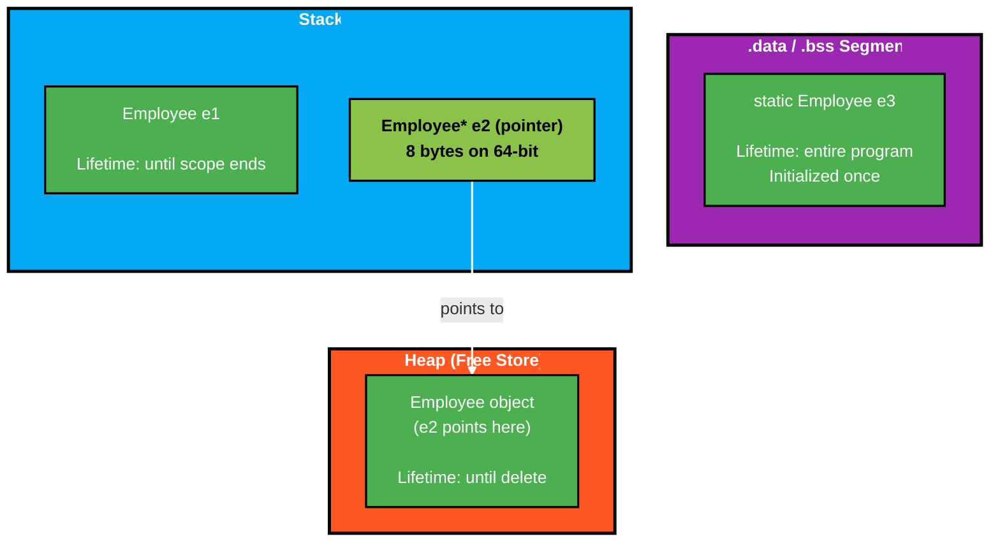

### 6.2 Object Memory Layout — What the Compiler Generates

When you define a class, the compiler calculates how many bytes each object will consume. The layout follows the declaration order of member variables:

```cpp
class Person {
private:
    int id;             // 4 bytes (offset 0)
    char grade;         // 1 byte  (offset 4) + 3 bytes padding
    double salary;      // 8 bytes (offset 8)
};
// sizeof(Person) = 16 bytes (not 13, due to alignment padding)
```

**Alignment and padding** are inserted by the compiler so that each member sits at an address that is a multiple of its size. This is a hardware requirement — misaligned reads on some architectures (ARM Cortex-M, for example) cause hard faults.

| Offset | Member | Size | Padding After |
|--------|--------|------|---------------|
| 0 | `id` | 4 bytes | 0 |
| 4 | `grade` | 1 byte | 3 bytes |
| 8 | `salary` | 8 bytes | 0 |
| | **Total** | **16 bytes** | |

**Reordering members can reduce object size:**

```cpp
class PersonOptimized {
    double salary;      // 8 bytes (offset 0)
    int id;             // 4 bytes (offset 8)
    char grade;         // 1 byte  (offset 12) + 3 bytes padding
};
// sizeof(PersonOptimized) = 16 bytes — same here, but matters for larger classes
```

In classes with many members, reordering from largest to smallest alignment can save significant memory, especially when allocating thousands of objects.

### 6.3 Where Methods Live — The Text Segment

Member functions do NOT live inside each object. They exist once in the `.text` (code) segment, shared by all instances:

```cpp
class Circle {
    double radius;  // Each object gets its own copy (4-8 bytes per object)
public:
    double area() const { return 3.14159 * radius * radius; }
    // area() exists ONCE in .text segment, not duplicated per object
};

Circle c1, c2, c3;
// Memory: 3 copies of 'radius', but only 1 copy of area()'s machine code
```

This is why `sizeof(Circle)` equals `sizeof(double)` — the method contributes zero bytes to the object's size. The `this` pointer (passed implicitly) tells the shared function which object's data to operate on.

### 6.4 Virtual Functions — The Memory Cost of Polymorphism

Adding even one `virtual` function changes the object layout. The compiler inserts a hidden pointer called `vptr`:

```cpp
class Shape {
    double x, y;                    // 16 bytes
public:
    virtual double area() = 0;     // Adds hidden vptr: +8 bytes (64-bit)
};
// sizeof(Shape) = 24 bytes (16 data + 8 vptr)

class Circle : public Shape {
    double radius;                  // 8 bytes
public:
    double area() override { return 3.14159 * radius * radius; }
};
// sizeof(Circle) = 32 bytes (24 from Shape + 8 radius)
```

The `vptr` points to a **vtable** — a static array of function pointers, one per virtual method. Each class has its own vtable, stored in the `.rodata` segment:

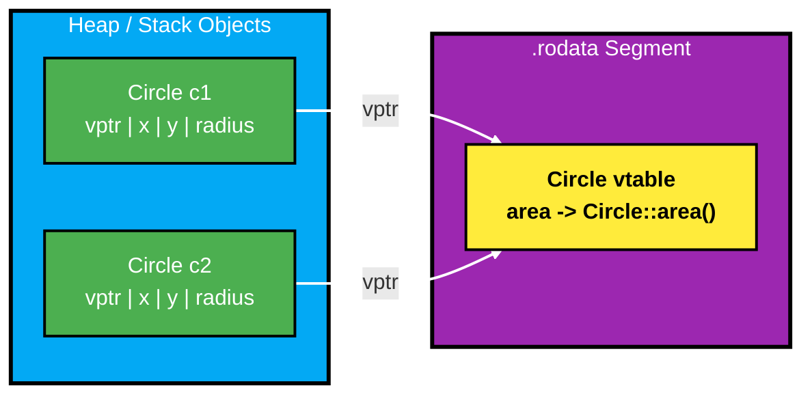

**The cost:** One pointer per object (8 bytes on 64-bit), plus one vtable per class (not per object). For a class with 5 virtual functions, the vtable is 5 pointers (40 bytes), but only one copy exists regardless of how many objects you create.

### 6.5 Static Members — Shared Memory, Single Location

Static members exist outside any object instance. They live in the `.data` segment (if initialized) or `.bss` segment (if zero-initialized):

```cpp
class Connection {
    int socketFd;                        // Per-object: stack or heap
    static int activeConnections;        // Shared: .data segment
    static const int MAX_CONNECTIONS;    // Shared: .rodata segment
};

int Connection::activeConnections = 0;         // .data (mutable global)
const int Connection::MAX_CONNECTIONS = 100;    // .rodata (read-only global)
```

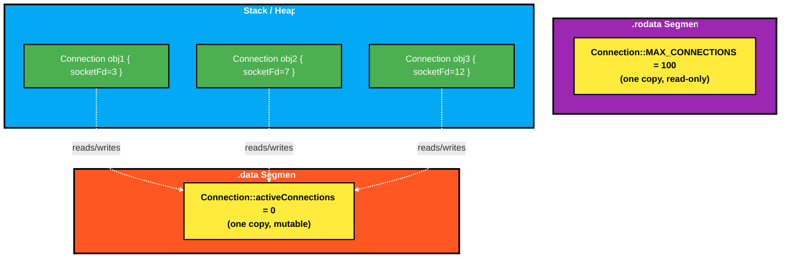

**Key insight:** `sizeof(Connection)` includes only `socketFd` (4 bytes), not the static members. Static members are allocated once by the linker, regardless of how many objects exist — even if zero objects are created.

### 6.6 Inheritance and Memory — How Base Classes Stack

Derived class objects contain the base class as a sub-object, laid out first in memory:

```cpp
class Person {
    int id;          // 4 bytes
    string name;     // 32 bytes (typical std::string)
};
// sizeof(Person) = 40 bytes (with padding)

class Employee : public Person {
    int salary;      // 4 bytes
};
// sizeof(Employee) = 48 bytes (Person sub-object + salary + padding)
```

The layout in memory looks like this:

| Offset | Member | Belongs To |
|--------|--------|------------|
| 0x00 | `id` | `Person` sub-object |
| 0x08 | `name` | `Person` sub-object |
| 0x28 | `salary` | `Employee` own data |

**Upcasting works because the `Person` portion is at the beginning.** When you cast `Employee*` to `Person*`, the pointer value doesn't change — it already points to a valid `Person` layout.

### 6.7 Encapsulation and Memory — The Compile-Time Firewall

A common misconception: "Private members are stored differently than public ones." They are not. The compiler enforces access control entirely at compile time:

```cpp
class Vault {
private:
    int secretCode = 42;    // Same memory as if it were public
public:
    int label = 7;          // Physically adjacent to secretCode
};

Vault v;
// In raw memory: [42][7] — no encryption, no separation, no runtime check
// The compiler simply refuses to compile: v.secretCode = 0;
```

Encapsulation is a design-time and compile-time discipline. At runtime, memory is just bytes. This is why `reinterpret_cast` can bypass access control — it operates at the memory level, below the compiler's type system. It is also why encapsulation remains valuable: it prevents accidental misuse, not malicious hacking.

---

## 7. Pointers vs References — A Structured Comparison

Pointers and references are both mechanisms for indirection in C++, but they have fundamentally different semantics, safety profiles, and use cases.

### 7.1 Core Differences

| Property | Pointer (`T*`) | Reference (`T&`) |
|----------|----------------|-------------------|
| Can be null | Yes (`nullptr`) | No — must always refer to a valid object |
| Can be reassigned | Yes — can point to different objects | No — bound at initialization, forever |
| Requires dereferencing | Yes (`*ptr`, `ptr->member`) | No — used like the original variable |
| Has its own address | Yes — occupies memory (4 or 8 bytes) | Implementation-defined — may or may not |
| Arithmetic | Yes (`ptr++`, `ptr + n`) | No |
| Can point to nothing | Yes (dangling pointer) | Technically no, but dangling references exist |
| Levels of indirection | Unlimited (`T**`, `T***`) | Only one level |

### 7.2 Memory Behavior

```cpp
int x = 42;

int* ptr = &x;    // ptr is a separate variable (8 bytes on 64-bit)
                   // Stored at its own address, contains address of x

int& ref = x;     // ref is an alias for x
                   // Compiler may or may not allocate memory for it
                   // Under the hood, often implemented as a const pointer
```

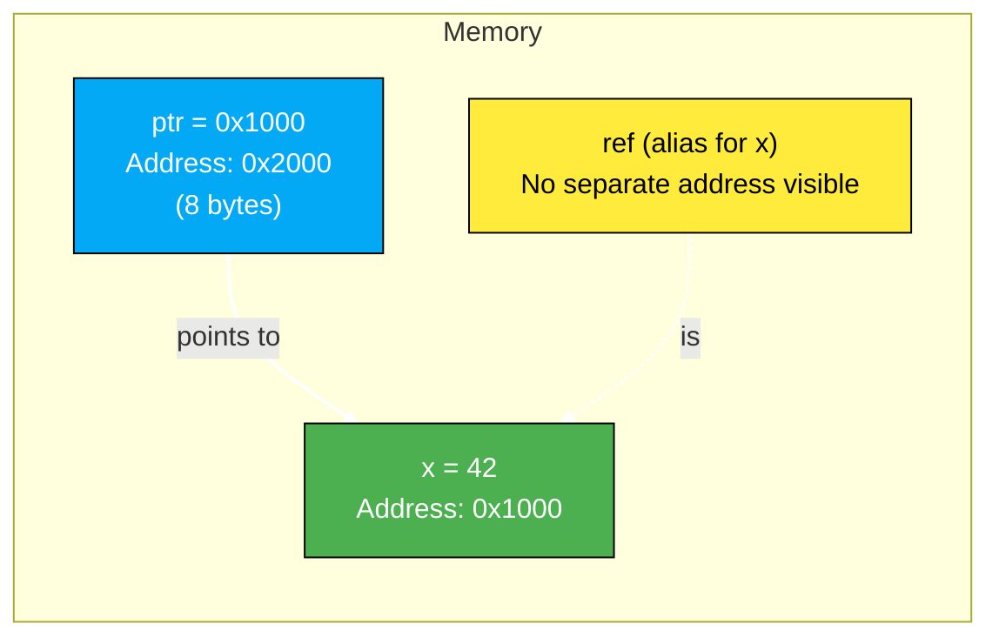

### 7.3 When to Use Each

**Use references when:**
- You want to pass large objects to functions without copying
- The callee does not need to manage lifetime or rebind
- You want clean syntax (`obj.member` instead of `obj->member`)
- The value is guaranteed to exist (non-optional parameter)

```cpp
// Clean function signature — reference parameters
void calculateBonus(const Employee& emp, double& result) {
    result = emp.getSalary() * 0.10;
}
```

**Use pointers when:**
- The value might be absent (`nullptr` as "no value")
- You need to dynamically allocate or transfer ownership
- You need to rebind to different objects over time
- You are working with arrays or pointer arithmetic
- Interfacing with C APIs or hardware registers

```cpp
// Pointer for optional relationship
class TreeNode {
    int value;
    TreeNode* left;     // May be nullptr (no left child)
    TreeNode* right;    // May be nullptr (no right child)
};
```

### 7.4 Common Pitfalls

**Dangling reference — returning a reference to a local variable:**
```cpp
int& dangerous() {
    int localVar = 42;
    return localVar;    // localVar destroyed when function returns
}
// The returned reference refers to deallocated stack memory — undefined behavior
```

**Dangling pointer — using a pointer after the object is deleted:**
```cpp
int* alsoUnsafe() {
    int* p = new int(42);
    delete p;
    return p;           // p still holds the old address, but memory is freed
}
// Dereferencing the returned pointer is undefined behavior
```

**The practical rule:** References are safer by default because they cannot be null and cannot be rebound. Prefer them unless you need the flexibility that pointers provide.

---

## 8. How SOLID Principles Connect to Memory

The SOLID principles aren't just abstract design rules — they directly affect how much memory your program uses and where that memory lives. Here's a simple look at each principle.

### 8.1 Single Responsibility Principle (SRP)

> "A class should do one thing only."

**Memory connection:** Classes that do many things become bloated. More member variables = bigger objects = more memory per instance.

```cpp
// BAD — One class doing everything
class MegaClient {
    string name, password;       // User data
    double balance;              // Account data
    fstream file;                // File I/O
    vector<string> logs;         // Logging
    int screenWidth, screenHeight; // UI concerns
};
// sizeof(MegaClient) is huge — wastes memory

// GOOD — Each class does one thing
class Client {
    string name, password;
    double balance;
};
// sizeof(Client) is lean — only what's needed
```

When each class has one job, objects stay small and focused.

### 8.2 Open/Closed Principle (OCP)

> "Open for extension, closed for modification."

**Memory connection:** OCP often uses virtual functions. This adds a `vptr` (8 bytes per object) and vtables in memory.

```cpp
class Game {
    Creature* creatures[10];  // Base pointer — uses polymorphism
};

// Add new creature types WITHOUT changing Game:
creatures[0] = new Human();   // Each has vptr (8 bytes)
creatures[1] = new Animal();  // Each has vptr (8 bytes)
```

**Cost:** +8 bytes per object for the `vptr`. It's a small price for big flexibility.

### 8.3 Liskov Substitution Principle (LSP)

> "Child classes should work anywhere the parent works."

**Memory connection:** Derived classes should have similar memory sizes. Don't make one child dramatically bigger.

```cpp
// GOOD — Both children are small
class Shape {
    double x, y;  // 16 bytes
};
class Circle : public Shape {
    double radius;  // 16 + 8 = 24 bytes total
};
class Rectangle : public Shape {
    double w, h;    // 16 + 16 = 32 bytes total
};

// BAD — One child is massive
class MassiveShape : public Shape {
    int pixels[1000000];  // 16 + 4MB — breaks expectations!
};
```

When all children have predictable sizes, your code won't explode unexpectedly.

### 8.4 Interface Segregation Principle (ISP)

> "Don't force classes to implement methods they don't need."

**Memory connection:** Big interfaces create big vtables. Split them up.

```cpp
// BAD — Fat interface forces large vtable
class IDevice {
    virtual void read() = 0;
    virtual void write() = 0;
    virtual void configure() = 0;
    virtual void test() = 0;
    virtual void calibrate() = 0;
};
// vtable has 5 slots = 40 bytes (even if you only need read/write)

// GOOD — Small interfaces, small vtables
class IReadable { virtual void read() = 0; };   // 8-byte vtable
class IWritable { virtual void write() = 0; };  // 8-byte vtable
```

Smaller interfaces = smaller vtables = less memory waste.

### 8.5 Dependency Inversion Principle (DIP)

> "Depend on abstractions (interfaces), not concrete classes."

**Memory connection:** Using abstract interfaces means using pointers, which usually means heap allocation.

```cpp
class Application {
    ILogger* logger;   // Abstract pointer — typically allocated on heap
public:
    Application(ILogger* log) : logger(log) {}
};

// At runtime:
ILogger* log = new FileLogger("app.log");  // Heap allocation
Application app(log);
```

**Trade-off:** You get flexibility (swap implementations easily), but objects must be allocated dynamically.

### 8.6 Quick Summary

| Principle | Memory Effect | Simple Rule |
|-----------|---------------|-------------|
| **SRP** | Smaller objects | One job = less bloat |
| **OCP** | +8 bytes for vptr | Virtual functions cost a pointer |
| **LSP** | Predictable sizes | Children shouldn't be massive |
| **ISP** | Smaller vtables | Split big interfaces |
| **DIP** | More heap usage | Abstractions = pointers = heap |

---

## 9. Book Deep Integration

### 9.1 Key Concepts from "The Object-Oriented Thought Process"

Matt Weisfeld's book transformed abstract theory into practical wisdom. The secret? **Think in objects before thinking in code.** 

Here's how the book's philosophy manifests in a well-designed Bank System:

**9.1.1 Minimal Interface Principle**

> "Provide the user with as little knowledge of the inner workings of the class as possible."

A well-designed `Client` class exposes `deposit()`, `withdraw()`, `transferTo()` — not the raw `balance` variable. Users of the class can't put it in an invalid state.

**9.1.2 The Implementation Should Be Hidden**

> "The implementation is a way for the user to be shielded from the internal working of the class."

A `DataSourceInterface` is a perfect example. The rest of the system calls `addClient()` without knowing whether data goes to a file, database, or API.

**9.1.3 Contractual Design**

> "When a user uses a class, a contract is formed between the class and the user."

The contract of a `Client::withdraw()` method:
- **Precondition:** `amount > 0` and `balance - amount >= 1500`
- **Postcondition:** `balance` is reduced by `amount`
- **Invariant:** `balance >= 1500` is always maintained

A `Validation` utility class is one way to enforce these contracts.

**9.1.4 Composition vs Inheritance (Book Chapter 7)**

> "Composition should be used when behavior needs to be reused, but no IS-A relationship exists."

An `Invoice` HAS-A `Customer` (composition) — correct! An invoice is not a customer.  
A `Patient` IS-A `Person` (inheritance) — correct! A patient is a person.

**9.1.5 Building Objects Responsibly**

> "Do not put too many features into one class."

A well-structured Bank System separates:
- Data models (Person, Client, Employee, Admin)
- Services (ClientManager, EmployeeManager, AdminManager)
- Utilities (Validation, Parser)
- Persistence (FilesHelper, FileManager)
- UI (Screens)

This is well-aligned with the Single Responsibility Principle.

### 9.2 Concepts You May Have Skipped from the Book

**9.2.1 Aggregation of Objects in Practice**

The book discusses how objects cooperate. A `Room` class demonstrates this with `Instructor*` and `Student*[]`, but the concept goes deeper:

**Delegation:** When one object forwards a request to another:
```cpp
// FileManager delegates to FilesHelper
void FileManager::addClient(const Client& client) {
    FilesHelper::saveClient(client);  // Delegation
}
```

**9.2.2 Designing with Interfaces (Chapter 8)**

The book emphasizes programming to interfaces, not implementations. A `DataSourceInterface` is an excellent example of this. Consider applying the principle more broadly:

```cpp
// Instead of:
class Game {
    Human* people[10];    // Depends on concrete class
    Animal* animals[10];  // Depends on concrete class
};

// You can correctly refactor to:
class Game {
    Creature* creatures[10];  // Depends on abstraction
};
```

**9.2.3 Object Serialization**

The book covers how objects should be serializable. A `Parser` class can handle this:
- `Client` → `"1,Ahmed,pass123,5000.0"` (serialization: object → string)
- `"1,Ahmed,pass123,5000.0"` → `Client` (deserialization: string → object)

This is a form of the **Memento Pattern** — saving and restoring object state.

**9.2.4 The Liskov Substitution Principle (LSP)**

The book reinforces a principle from Barbara Liskov: **any subclass should be substitutable for its parent class without breaking the program's correctness.**

In practice, this means:
```cpp
void processAccount(Person& person) {
    // This function should work correctly whether person is a
    // Client, Employee, or Admin — without needing to know which.
}
```

Violations of LSP happen when a derived class changes the expected behavior of the base class. For example, if `Client::withdraw()` threw an exception that `Person` never documented, code expecting `Person` behavior would break.

**The LSP test:** Can you replace every `Person*` with a `Client*` or `Employee*` and have the program still behave correctly? If yes, your inheritance hierarchy is sound.

**9.2.5 The Interface Segregation Principle (ISP)**

> "Clients should not be forced to depend on interfaces they do not use."

If a single interface grows too large, split it:
```cpp
// BAD — One bloated interface
class IUserOperations {
    virtual void deposit() = 0;
    virtual void withdraw() = 0;
    virtual void manageEmployees() = 0;  // Clients don't need this!
    virtual void generateReports() = 0;  // Clients don't need this either!
};

// GOOD — Segregated interfaces
class IClientOperations {
    virtual void deposit() = 0;
    virtual void withdraw() = 0;
};

class IAdminOperations {
    virtual void manageEmployees() = 0;
    virtual void generateReports() = 0;
};
```

This keeps each class lean — implementing only the interfaces that are relevant to its role.

**9.2.6 Object Responsibility — Objects as Self-Governing Entities**

Weisfeld emphasizes that objects should be responsible for themselves. An object should validate its own state and never rely on external code to keep it consistent:

```cpp
class Client {
    double balance;
public:
    // The Client itself enforces the minimum balance rule
    bool withdraw(double amount) {
        if (amount <= 0 || balance - amount < 1500.0)
            return false;
        balance -= amount;
        return true;
    }
    // No one outside can set balance to an invalid state
};
```

This means validation logic belongs *inside* the object, not scattered across the codebase. When an object governs itself, bugs can only come from one place.

### 9.3 Professional Best Practices from the Book

1. **Keep interfaces minimal** — expose only what's necessary
2. **Don't expose implementation details** — use private/protected
3. **Design for maintenance** — code changes are inevitable
4. **Use abstract classes to define contracts** — derived classes implement them
5. **Prefer composition when there's no clear IS-A** — more flexible
6. **Objects should be self-governing** — validate their own state
7. **Design for testability** — separate concerns into distinct classes

---

**Welcome to the journey. Now go write some code.**
